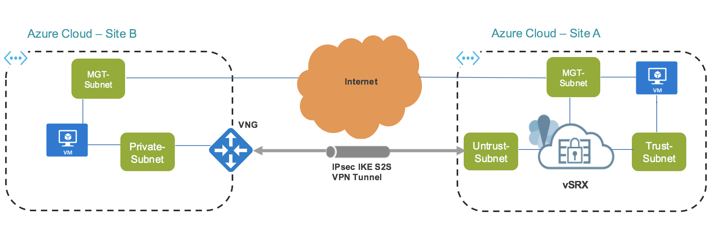

# Using vSRX Next Generation Firewall to securely connect your local network to a remote site (Azure VNG) while providing East-West traffic inspection

This ARM template deploys vSRX Next Generation Firewall (NGFW), to a new or existing local VNet and an Azure Virtual Network Gateway to a remote site (VNet). By using Azure Managed Secure Identity and Azure REST APIs, it then automatically sets up a site to site VPN tunnel between vSRX and VNG. Furthermore, necessary User Defined Routes (UDR) are insterted in the vSRX VNet route table to steer all East-West traffic to vSRX. Two clients, one in each VNet are also deployed with proper routes in their route tables to test connectivity between the two sites. 
Note: The time to deploy this template largely depends on the time that it takes to create Azure Virtual Network Gateway.

